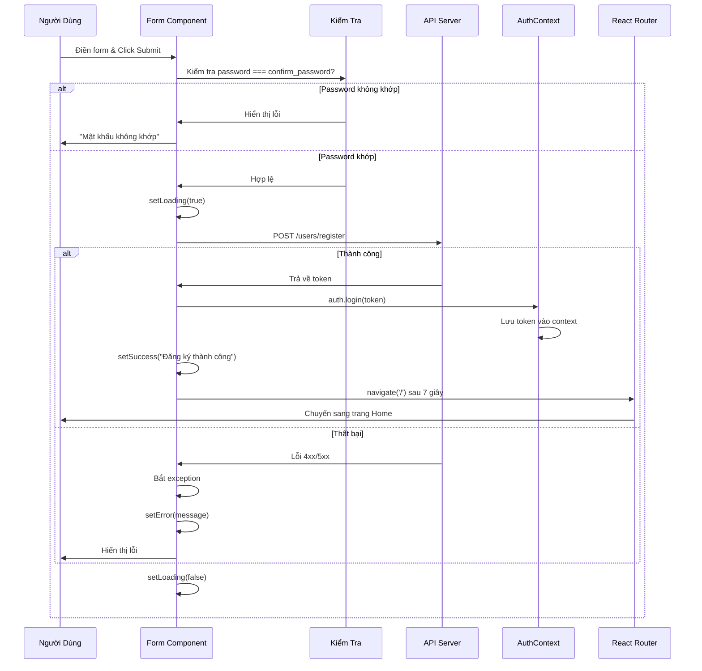
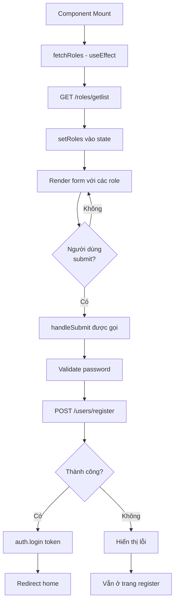
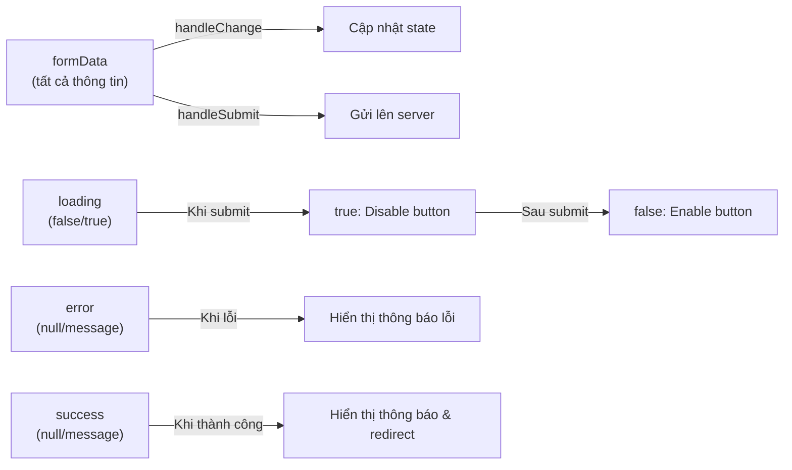
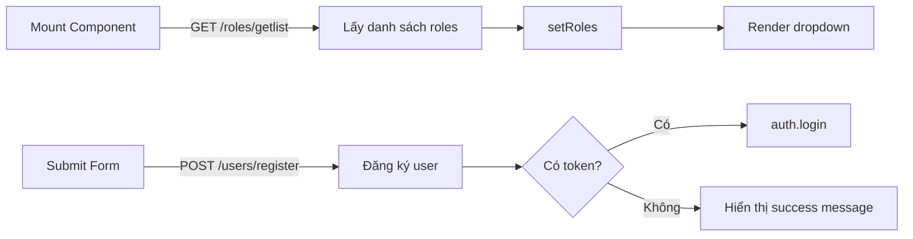

# Sơ Đồ Tuần Tự RegisterPage

## 1. Sơ Đồ Luồng Khi Submit Form

## 2. Sơ Đồ Vòng Đời Component (Lifecycle)

## 3. Sơ Đồ State Management

## 4. Chi Tiết Các Bước Chính

| Bước | Hành Động | State Thay Đổi |
|------|----------|----------------|
| 1 | Người dùng nhập form | `formData` cập nhật |
| 2 | Click Submit | `setError(null)`, `setSuccess(null)` |
| 3 | Kiểm tra password | Nếu sai → Lỗi & return |
| 4 | Gửi request | `loading = true` |
| 5 | API thành công | `auth.login(token)` → Redirect |
| 6 | API thất bại | `setError(message)` |
| 7 | Kết thúc | `loading = false` |

## 5. Danh Sách Các API Calls

---

## Cách Sử Dụng Diagram Này

1. **Xem tại đây**: Mở file này trong VS Code với extension Markdown Preview Enhanced hoặc Markdown Preview
2. **Copy sang draw.io**: Vào https://mermaid.live, paste Mermaid code ở trên
3. **Các tool khác**:
   - **draw.io/Lucidchart**: Vẽ diagram tương tự bằng UI
   - **PlantUML**: Dùng language khác tương tự Mermaid
   - **Figma**: Vẽ theo style của bạn

Bạn có thể cài extension **Markdown Preview Enhanced** hoặc **Mermaid** trong VS Code để xem diagram ngay tại editor!
